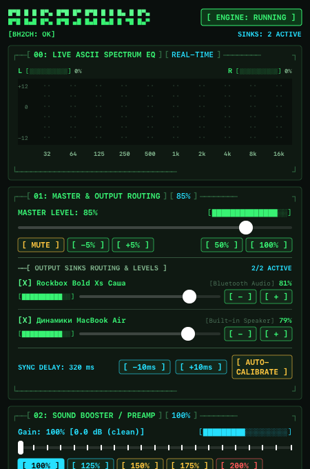
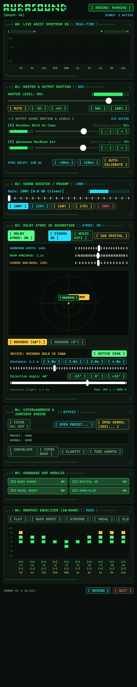

# AuraSound Max (SoundBarBoost)

Утилита для macOS, которая позволяет выводить системный звук одновременно на несколько устройств (например, встроенные динамики MacBook и внешнюю Bluetooth-колонку или саундбар) с автоматической аппаратной компенсацией задержки через микрофон.

## Зачем это нужно

В macOS можно создать «Многовыходное устройство» через стандартный Audio MIDI Setup, но на практике при одновременном выводе на динамики мака и Bluetooth-колонку получается каша:
1. Bluetooth-стек и ЦАП внешней колонки дают аппаратную задержку от 100 до 350+ мс. Звук двоится, возникает неприятное эхо.
2. Штатные средства macOS не умеют задерживать быстрый динамик, чтобы подогнать его под медленный.
3. Со временем тактовые генераторы устройств расходятся, и рассинхрон начинает плавать.

AuraSound Max перехватывает системный поток через BlackHole, раскидывает его по независимым CoreAudio IOProc с индивидуальными кольцевыми буферами, калибрует разницу задержек по акустическому отклику комнаты и держит устройства в фазе без ресемплинговых щелчков.

## Что внутри

- **Автосинхронизация по розовому шуму:** При нажатии кнопки калибровки приложение по очереди проигрывает короткий непрерывный отрезок розового шума на каждом спикере. Микрофон мака ловит отклик, а алгоритм полосового GCC-PHAT (140 Гц – 10 кГц) через Apple Accelerate (vDSP) вычисляет точную разницу во времени прихода волны. Задержка компенсируется с точностью до миллисекунды.
- **Отличный 10-полосный эквалайзер:** Честный студийный EQ на базе каскада biquad-фильтров (от 32 Гц до 16 кГц) с нулевой задержкой. Фильтры изолированы под каждое устройство вывода независимо, поэтому звук остается чистым и не замыливается. В связке с ним работают отдельные регуляторы Bass Punch (плотный саб-бас без перегруза), Vocal Boost (вытягивание разборчивости речи и вокала) и встроенный прозрачный лимитер против клиппинга.
- **Поддержка импульсов ViPER4Android и JamesDSP:** Можно подкидывать свои `.irs` и `.wav` импульсы конволюции (кабинеты, акустика помещений, эквализация), настраивать динамический бас и четкость.
- **Пространственный звук (Dolby Atmos / 3D Spatializer):** Моделирование бинаурального кроссфида (cross-feed), ранних отражений и высотных каналов для расширения стереобазы.
- **Спектроанализатор:** Полноценный FFT-анализ спектра в реальном времени на базе vDSP, выведенный в интерфейс.
- **Работа из Menu Bar:** Приложение живет в строке меню (LSUIElement), не загромождая Dock.

## Интерфейс

<p align="center">
  
  &nbsp;&nbsp;&nbsp;&nbsp;
  
</p>

## Требования

- macOS 13.0 (Ventura) или новее
- Установленный виртуальный аудиодрайвер [BlackHole 2ch](https://github.com/ExistentialAudio/BlackHole)
- Разрешение на доступ к микрофону (требуется только в момент калибровки задержки)

## Установка BlackHole

Проще всего поставить через Homebrew:

```bash
brew install blackhole-2ch
```

После установки драйвер появится в системе как устройство ввода и вывода.

## Сборка и запуск

Проект написан на Swift с использованием SPM (Swift Package Manager) и CoreAudio HAL.

1. Клонируйте репозиторий или перейдите в папку с проектом:
```bash
cd AuraSound
```

2. Запустите скрипт сборки:
```bash
./build_app.sh
```

Скрипт скомпилирует бинарник в конфигурации Release, упакует его в `AuraSound Max.app` и настроит `Info.plist`.

3. Запустите приложение:
```bash
open "AuraSound Max.app"
```

## Как пользоваться

1. Откройте «Системные настройки» -> «Звук» и выберите **BlackHole 2ch** в качестве устройства вывода звука по умолчанию. Теперь весь звук системы идет в приложение.
2. В строке меню нажмите на иконку AuraSound Max.
3. В блоке выбора устройств отметьте галочками нужные выходы (например, «Динамики MacBook Pro» и вашу Bluetooth-колонку).
4. Если слышен рассинхрон, нажмите кнопку **Автокалибровка**:
   - Приложение на несколько секунд приглушит музыку.
   - По очереди прозвучит короткий тестовый сигнал из каждого динамика.
   - Микрофон определит разницу, и приложение автоматически выставит нужную задержку на опережающее устройство.
5. При необходимости подстройте громкость каждого устройства отдельно, включите пространственный эффект или загрузите импульс конволюции в соответствующей вкладке.

## Структура проекта

- `Sources/SoundBarBoost/RealAudioEngine.swift` — ядро CoreAudio HAL: захват потока из BlackHole, параллельные IOProc на устройства вывода, DSP-цепочка, многополосный EQ, фазовый ресемплинг и компенсация сдвига.
- `Sources/SoundBarBoost/AcousticAutoCalibrator.swift` — движок калибровки: генерация band-limited розового шума, захват микрофона, расчет взаимной корреляции (GCC-PHAT) и статистическая валидация пика (PSR).
- `Sources/SoundBarBoost/AudioDSPManager.swift` — состояние DSP-эффектов, загрузка импульсов JamesDSP/ViPER4Android, настройки громкости и пресетов.
- `Sources/SoundBarBoost/ViperDSPManager.swift` — конволюционный движок импульсов IRS, эмуляция ламп и алгоритмов чистоты звука.
- `Sources/SoundBarBoost/MainPopoverView.swift` — терминальный ретро-интерфейс, спектроанализатор и 2D-радар звуковой сцены.
- `build_app.sh` — сборка и упаковка в `.app` бандл.
